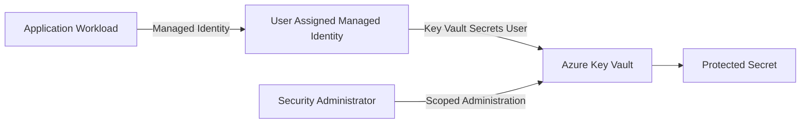

# Architecture

```mermaid
flowchart LR
    APP[Application Workload] -->|Managed Identity| MI[User Assigned Managed Identity]
    MI -->|Key Vault Secrets User| KV[Azure Key Vault]
    ADMIN[Security Administrator] -->|Scoped Administration| KV
    KV --> DATA[Protected Secret]
```

Security principle: workload identity receives only the data-plane permission it needs.
